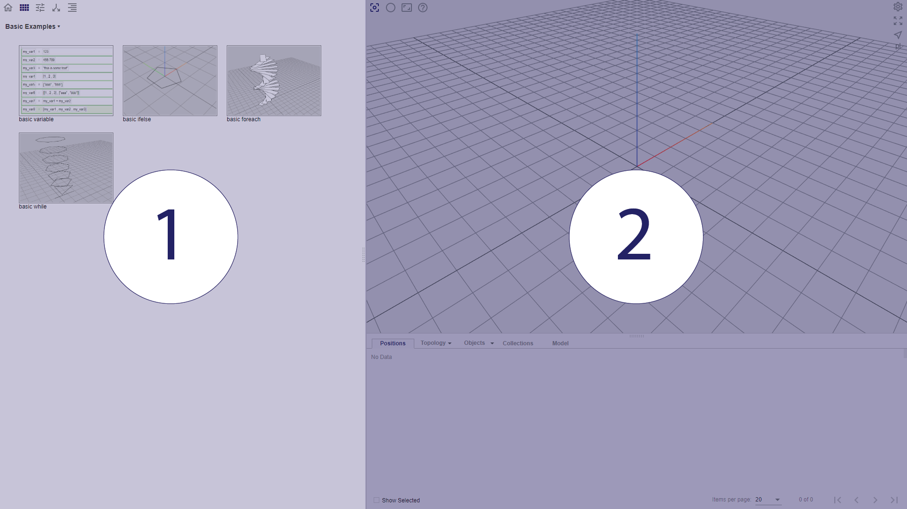

# Chapter 1: Möbius Interface

The workflow for parametric design often involves the use of flowcharts, which are graphic representations of the algorithmic process that is applied to the input information to produce a corresponding result. 

## User Interface Layout

Möbius Modeller consists of three viewports.
Generally, user interacts and gives commands in the left viewport while the right viewport visualises and returns model information.

*(1) Gallery and Parametric Design Flow (2) Visualisation & Debugging viewport*

Each viewport is bounded by a resizable bar. A break down of each viewport is elaborated in this chapter.