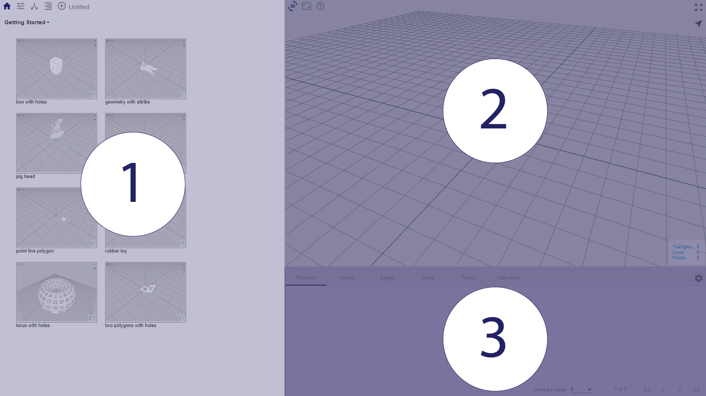

# Chapter 1: Parametric Design Flow

The workflow for parametric design often involves the use of flowcharts, which are graphic representations of the algorithmic process that is applied to the input information to produce a corresponding result. 

## User Interface Layout

Möbius Parametric Modeller user interface consists of three viewports.
Generally, user interacts and gives commands in the left viewport while the right viewports visualises and returns model information.

*(1) Gallery and Parametric Design Flow (2) 3D model viewport (3) Attribute table viewport*

A break down of the user interface controls in each viewport is elaborated in this chapter.