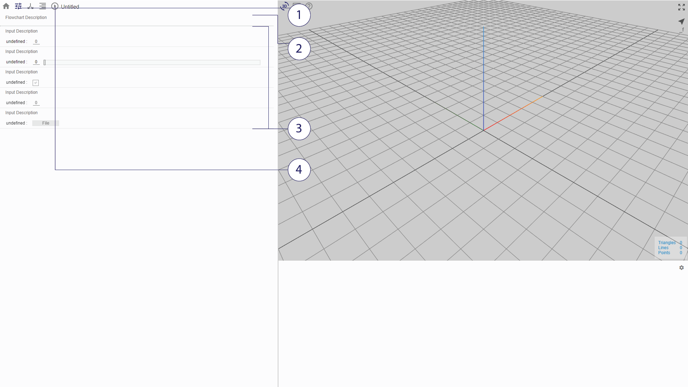

# Dashboard

The dashboard displays a description of the file and its modifiable parameters. Changing the value of a parameter here would correspondingly alter the values of the arguments used in the computation of the model.

*(1) Access Dashboard (2) Flowchart Description (3) Parameters (4) Execute Button*

## Parameters

There are five possible global variable types:
* *Simple Input* (Fixed Default Value)
* *Slider* (Modifiable Value, Fixed Range and Step)
* *Checkbox* (Modifiable)
* *URL* (Fixed Default Value)
* *File* (Modifiable)

## Try it!
[Mobius Modeller](https://design-automation.github.io/mobius-parametric-modeller/)

    Try Accessing an Example File in the Gallery, change a parameter, and click on the execute button.
