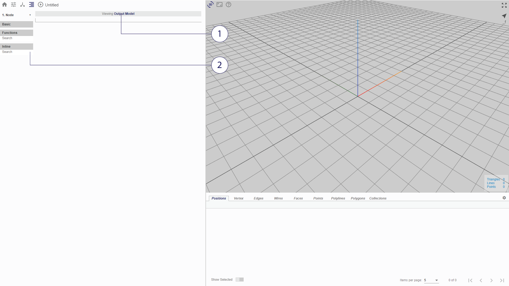
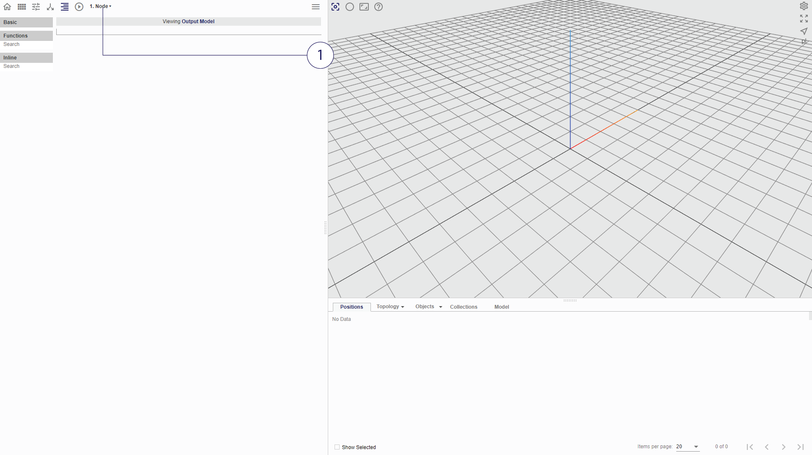

# Modelling Nodes

The links in the flowchart represent the 3D model that flows through the flowchart. The main modelling nodes each have a single input and a single output, defining the input model and output model. The procedure in each node converts the input model into the output model, making certain changes to it.

Double-clicking on any node in the flowchart brings you to the Procedure Tab, where you will see the following:

*(1) Model View button (2) Procedure Menu and Search Bar*

## Model View button
User may toggle between viewing the input and output model with the button.
* Viewing Input Model: Model passed down from the preceeding node, prior to running through the procedures in current node.
* Viewing Output Model: Resulting Model after performing procedures in current node.

## Procedural Modelling

Clicking on a 'Basic', 'Functions' or 'Inline' reveals a cascade of tools available in Möbius Modeller.

The search bar may be used to filter these.

* For more information on the above:
  * *'Basic'*: see Chapter 3
  * *'Functions'*: see Chapter 4
  * *'Inline'*: see Chapter 5

To *add* a line into the procedure, click on the desired component from the list on the left.
To *insert* a line between two existing lines, first select the line above where you want to insert your line. 

# Switching between nodes

Sometimes it is useful to switch from one node to another without having to navigate back to the flowchart. 

From the procedure view, user may use the drop-down menu to quickly access other nodes in the flowchart.
