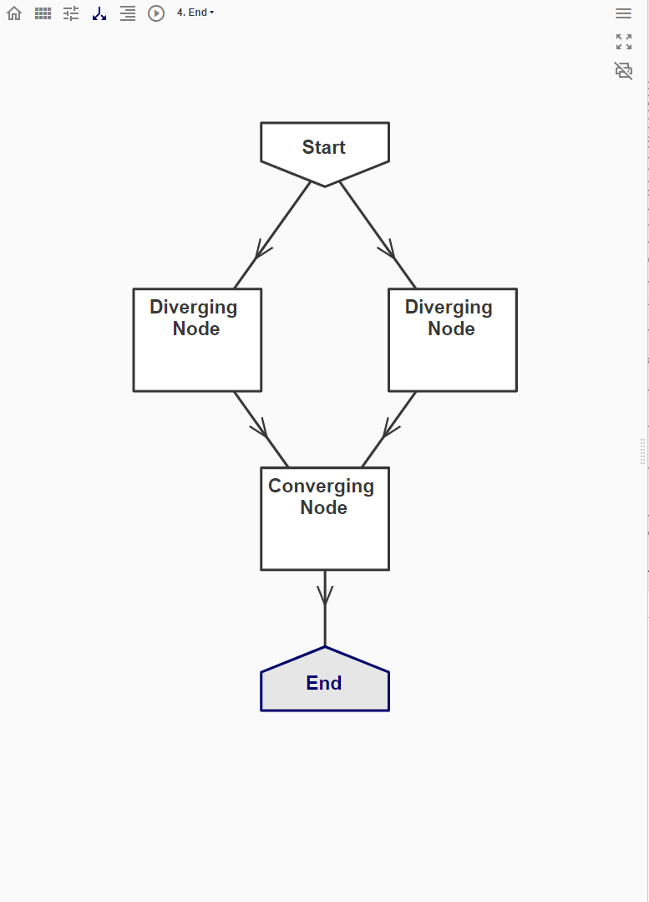

# Diverging/Converging nodes

In the 'Flowchart' tab, nodes may be connected in a way such that:
* a single node diverges and is connected to multiple nodes downstream
* multiple nodes converge and are merged into a single node downstream

## Diverging of nodes

When a single node diverges into multiple nodes, a copy of the model is generated for each of the nodes. This results in multiple instances of the model that each successor node can then modify. 

## Converging of nodes

When multiple nodes are merged into a single node, the models from each node are merged. Note that this may result in multiple copies of some geometry in the successor node. 
