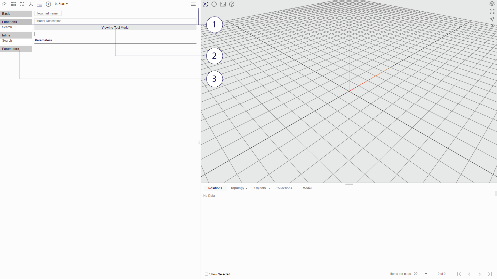

# 'Start' Node

The _Start_ node is the first node in the flowchart.

In the 'Start' node, _parameters_ for the whole flochart may be defined. These parameters represent values that the user can change each time the flowchart is executed. The parameter values can be read by the procedures in all downstream nodes. However, no other nodes can write to them, they are strictly read-only. 

Double Clicking on the Start node brings you to the Procedure Tab, where you will see the following:

*(1) Naming and Descriptions (2) Toggle test model view and tools (3) Parameters

## Flowchart Name and Description

The flowchart name and description may be assigned or modified via the input boxes in the 'Start' node. 

## Test Model Toggle

Although the start node is typically used for global variable declarations, in instances where the flowchart is being developed as a mobius function, all mobius functions are also accessible with the toggle of this button. This will allow the user to create test geometries which will be helpful when used during the scripting process.

## Parameters

Input parameters that are known or determined by the user, which may then be referenced throughout the flowchart. 

There are seven types of parameters:

* Constant
  * _Value_ - Value to be set as default value. Accepts expressions containing strings, numbers and mathematical operators. This value cannot be edited in the dashboard.

* Simple input
  * _Value_ - Value to be set as default value. Accepts expressions containing strings, numbers and mathematical operators.

* Slider
  * _Step_ - Increments for the slider
  * _Min_ - Minimum value for slider range
  * _Value_ - Numerical value to be set as default value
  * _Max_ - Maximum value for slider range

* Checkbox
  * _Checkbox_ - Boolean value of true or false; value alternates between the two when the clicked

* URL
  * _URL_ - Enter URL address to load file from

* File
  * _File_ - Upload file from computer

To _add_ a parameter, select the desired type from the left. A name has to be given in the corresponding input box in order for the variable to be referenced later. 

The values assigned to the parameters in this tab are the default values that will be loaded to the dashboard upon loading of the flowchart. In order to modify the argument without changing the default value, adjust the values in the dashboard instead.