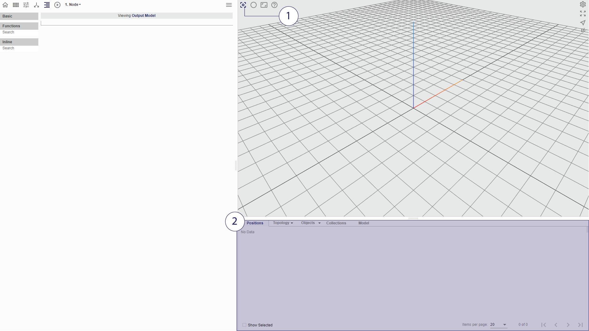
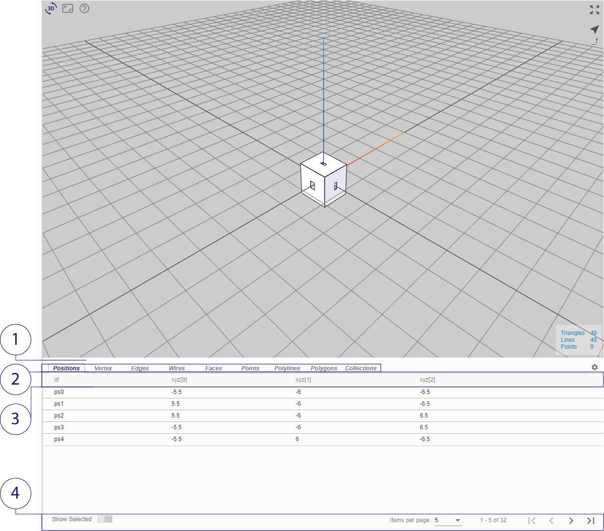

# Visualisation Viewport

Visualising the computed model and its attribute data is an essential part of the modelling process.
This section introduces the visualisation viewport and its navigation methods within Mobius Parametric Modeller.

*(1) Accessing 3D viewer (2) Attribute Table*

## 3D viewer

Within the 3D Viewer,
* To _rotate_, hold left-click and drag
* To _pan_, hold right-click and drag
* To _zoom_, scroll using the mouse wheel
* To _zoom extents_ the model, click on the icon at the top right corner as indicated below

### Visibility of geometry and mathematical constructs

There exists two broad types of elements in the model: geometry, which comprise real objects and visible; and mathematical structures, which are not objects and are by default invisible unless specified. 

* __Geometry__
  * Point
  * Polyline
  * Polygon
  * Vertex
  * Edge
  * Wire
  * Face
  * Collection

* __Mathematical structures__
  * Position
  * Vectors
  * Planes

For more information on the data model, please see Chapter 3. 

## Attribute Table
The 3D models created on Mobius Parametric Modeller can store attributes which can be extracted and modified in the procedures.

*(1) Split-bar (2) Object type tabs (3) Attribute Name Headers (4) Paginator*

1. Sharing the same viewport as the 3D model, user may configure the size of both viewers using the split bar between them.
2. To visualise the attributes stored within different geometrical objects, user may toggle the respective tabs in the top menu bar of the attribute table.
3. Objects may be sorted by the values of an attribute. Ascending/Descending order can be toggled by clicking on the respective attribute name header.
4. User may also set the number of attributes shown and cycle through the pages using the paginator in the bottom right corner.

For more information on Attributes, see Chapter 3. 