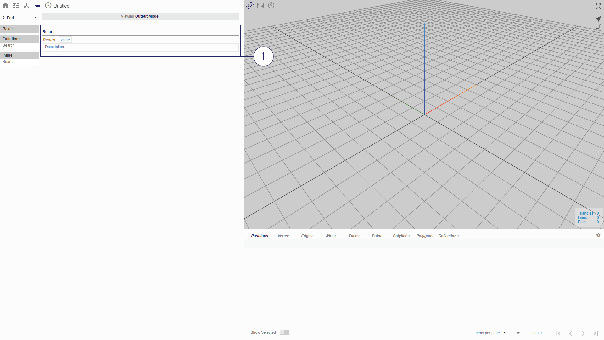

# 'End' Node

The _End_ node of a flowchart is the last node and is lowest in the flowchart. It processes all the nodes preceding it to display the results of the computation. In Möbius Modeller, the result of the 'End' node is the visualisation of the graph as a 3D model in the viewer.

*(1) Return Procedure*

Flowcharts may be saved and imported as a function in the procedure. To do so, user may define a variable used in the flowchart to be passed as the output.

_(For more information on flowchart as function, see Chapter 5.)_