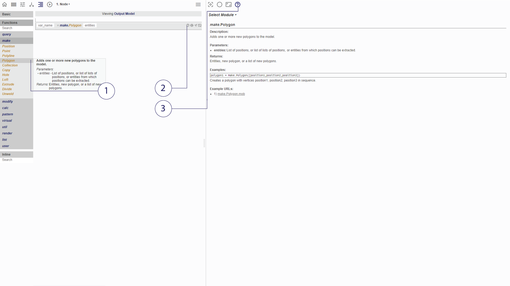

# Help and Debugging

Möbius Modeller provides aids to speed up the debugging process for the user.
The help viewer and debug console are both in the right viewport, which can be toggled by the buttons in the top left corner.

## Help

*(1) Tooltip (2) Help Toggle (3) Help Viewer*

1. A tooltip appears when the cursor hovers over a function. It contains a description of what the function does and its inputs and outputs.
2. Clicking the help button of an inline-function will access the respective help documentation. The full documentation will appear in the help viewer, which includes examples (not seen in the tooltip).
3. Access the Help Viewer. 

## Debugging
(Code with Error & Printing)
(Debugging Example - video)

## Try it!
(Simple Example with errors)
