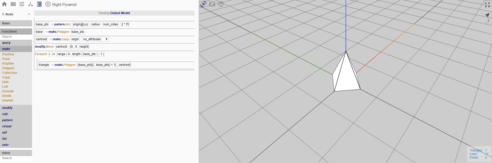
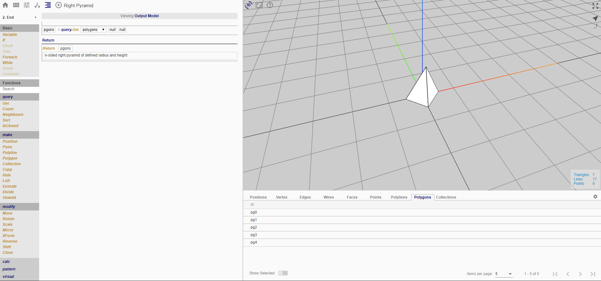
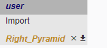

# Creating a Function
In this section, we will show a simple example of how a flowchart can be set up as a function.

__Objective__
We will be creating a function which creates a *right pyramid* with a base of *variable number of sides* and a *variable height*

__Translation__
By definition, a right pyramid can be any n-sided pyramid of radius r which has its apex directly above the centroid of its base.
Hence, our function will only need to take in these arguments:
1. origin
2. num_sides
3. radius
4. height

To achieve this, we will need to define them in the *start node*

*Name of flowchart will be the imported function name. Do add some description to your file and arguments as they will become part of the help and tooltip*

While ensuring that you are 'viewing the test model' (toggle view using the button in the procedure line), you can create your test geometry just like how you would do normally. In this case, we just need a position for the origin. Take note that we have now set the default value of the 'origin' constant as 'pos', which is defined to be a position in our test geometry. 'pos' only serves as a test geometry input for us to ensure that our function works.

*Create the function*

*You may use more than one node to create the function. If you do, you will need to query the resulting geometry which you wish to return in your function.*
In this case, we wish to return all polygons created in the function.

The function is done!

To import a function:
1. Functions > user > Import
2. Select your flowchart (function to be imported)

*Function will be added to your procedure on click*
In the toolset, you may delete an imported function by clicking on the 'x' icon. You may also download the function by clicking on the right button.

*Now use it in your other creations!*
