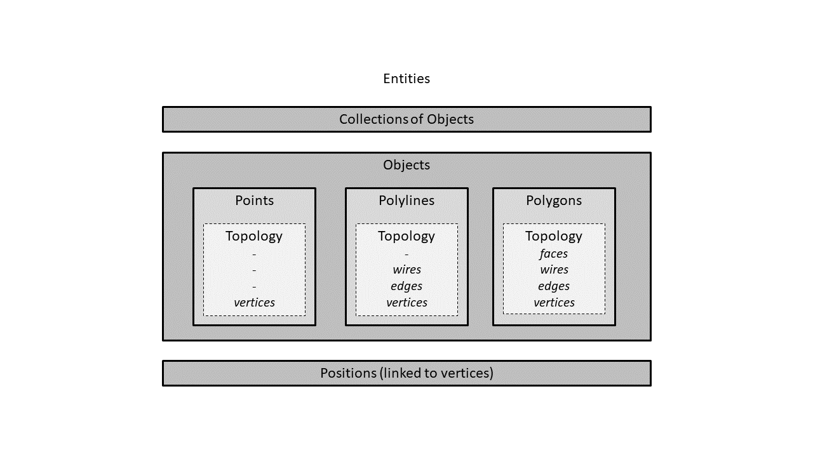

# Chapter 2: Data Model

*Hierarchy of the data model*

The model contains the following types of data:

__Geometry__

User-defined geometry
  * _Position_
  * _Point_
  * _Polyline_
  * _Polygon_
  * _Collection_

Topology
  * _Vertex_
  * _Edge_
  * _Wire_
  * _Face_

__Attributes__

__Mathematical structures__
  * _Coordinates_
  * _Vector_
  * _Plane_