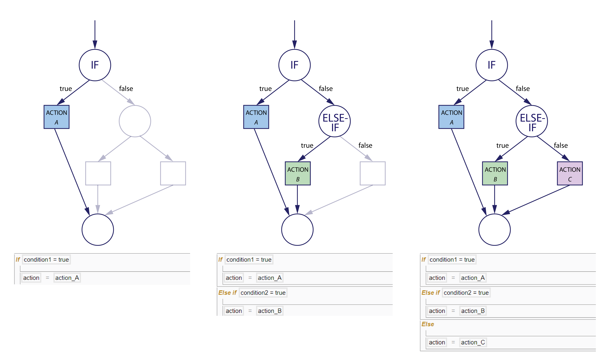

# Control Statements

Control statements may be divided into two broad categories: _selection_ and _repetition_.

## Selection

_Selection_ statements specify a condition and then determines what is to be done, depending on whether the condition is true.

*(1) If (2) If + Else-if (3) If + Else-if + Else*

### If

The _If_ statement performs an action(s) if a condition is true; otherwise, it skips the action(s). 

### Else-if

The _Else-if_ statement is an extension of the _If_ statement and may only be used following it. When used together, the statements perform an action(s) if a condition is true; otherwise, it checks a second condition. If the second condition is true, it performs an action(s); otherwise, it skips the action(s). 

This statement is used to create multiple levels of conditionals with a hierarchy that determines the sequence of checks performed.

### Else

The _Else_ statement is an extension of the _If_ or _Else-if_ statement and may only be used following either. When used together, the statements perform an action(s) if a condition is true; otherwise, it performs another different action(s).

## Repetition

_Repetition_ statements perform action(s) repeatedly based on the value of a condition; these are also known as loops or looping statements.

*(1) For-each (2) While*

### For-each

The _For-each_ statement performs an action(s) for every element of a finite array or list. 

### While

The _While_ statement performs an action(s) as long as the specified condition remains true. Unlike the _For-each_ statement, there is no specified limit to the number of times that the block is run, so long as the condition remains true.

### Break

The _Break_ statement is used within a _For-each_ or _While_ loop to break the loop and terminate it by skipping the remaining code within the loop and continuing the execution of code outside the loop. 

This statement is used with an _If_ statement within the loop to specify the test condition, where the break is performed if the condition is met. 

### Continue

The _Continue_ statement is used within a _For-each_ or _While_ loop to skip the remaining code within the current iteration of the loop and continuing the execution of code in the next iteration of the loop. Unlike _Break_, _Continue_ does not terminate the loop but only interrupts that particular iteration. 

This statement is used with an _If_ statement within the loop to specify the test condition, where the continuation is performed if the condition is met. 