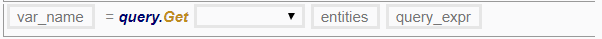
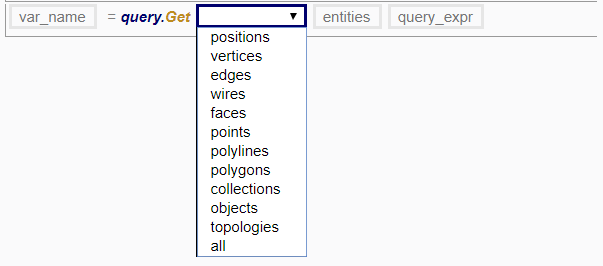
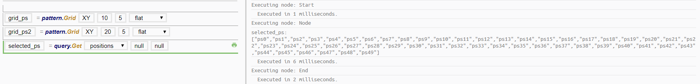
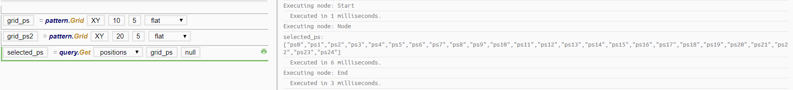
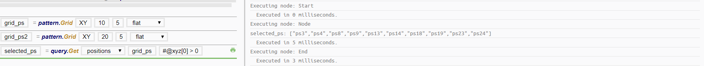
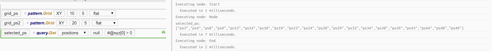

# query.Get

*query.Get* is the most important function that you will need; it allows you to specify certain search conditions and returns the entities as a list. 

The first box on the left-hand side of the function name is the variable name. Subsequently, this variable would refer to the results of the query as a list. 

The first box on the right-hand side of the function name is an enum dropdown list specifying the type of entity that you are searching for. 

The second box specifies the boundaries of your search, or what you are searching amongst. Specifying `null` would mean to search the entire model without restricting the search to any boundary. 

The third box specifies the search condition of your search using attributes, or the filter that you want to use. Specifying `null` would mean to search without any limiting by attributes. 

* The condition `#@attrib == 0` translates as such: 
  * `#` means "any";
  * `@attrib` means "with the attribute named *attrib*";
  * `== 0` means "equal to the value of 0" (other comparison operators are allowed as well).

