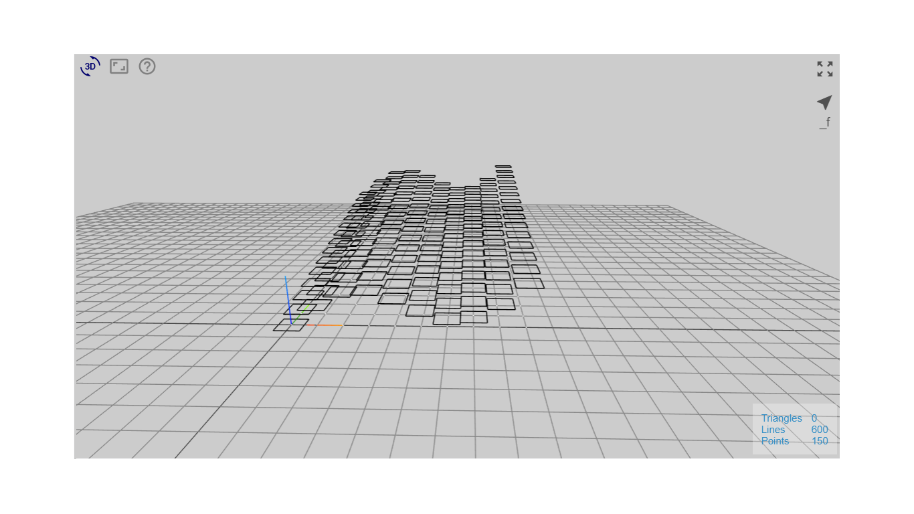
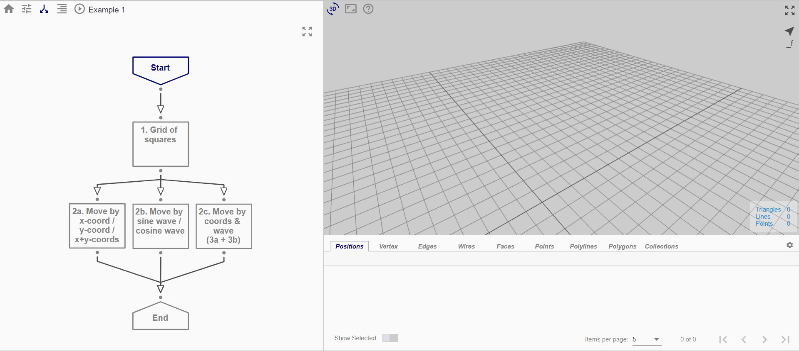

# Example 1

In Example 1, we are going to create a grid of rectangles that are displaced vertically based on their positions in the grid.

## Overview

The generation of the end result may be broken down into a series of smaller steps.

* *Start Node:* Input parameters
* *Node 1:* Create grid of positions
* *Node 2:* For each position, create a closed rectangular polyline around it
* *Node 3a:* Displace each rectangle in z-direction by x- or y- coordinate
* *Node 3b:* Displace each rectangle in z-direction by sine or cosine wave function
* *Node 3c:* Displace each rectangle in z-direction by both x/y-coordinate and sin/cos wave

## File

Click [here](https://mobius.design-automation.net/) to open the flowchart for Example 1 in Möbius Modeller.