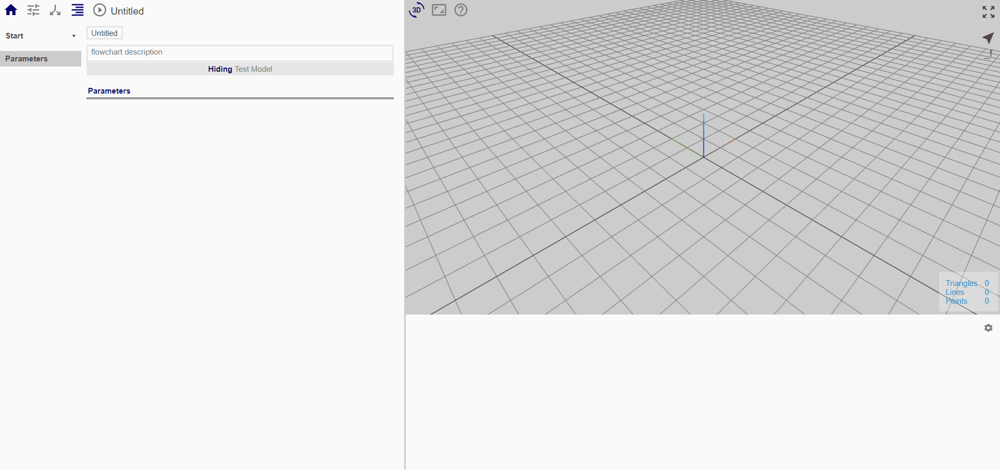
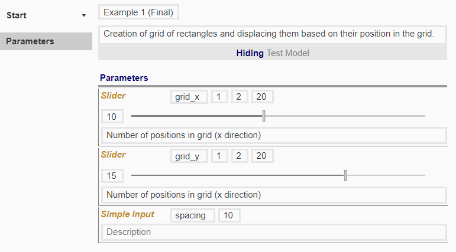

# 'Start' Node

Go to the 'Start' node of the flowchart in the Procedure tab. 

## Input parameters

We want to create a grid of positions on the x-y plane (x by y) as shown below:

**IMAGE**

Instead of having a fixed value for x and y, we want to be able to vary these so that the geometry dependent on these positions will change accordingly. Therefore, instead of using numbers, we are going to define the number of columns and rows as the variables *grid_x* and *grid_y* respectively. 

Similarly, we will define the distance between adjacent positions in the grid as the variable *spacing* so that this can also be varied. 

## Creating input parameters

We will use sliders to represent the variables *grid_x* and *grid_y*, and simple input for *spacing*. Sliders allow manipulation of the values within a specified range; this is useful in our case to control the ranges of each so that the eventual pattern is discernible. 

To create the 2 slider inputs and 1 simple input, follow the steps as shown:

For now, input the values as shown below. The values here will be the default values for the flowchart. You may vary the values in the dashboard tab; doing so there will ensure that the values are kept within the ranges specified in the 'Start' node without changing the settings. 

It will also be useful to name your flowchart and enter its description. It is not strictly necessary, but good practice to do so, so that others who use your flowchart will understand what it is doing. This is especially important when importing flowcharts as functions. 