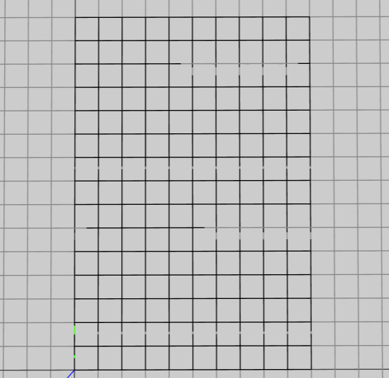
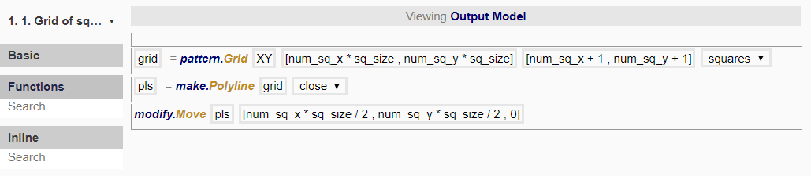

# Node 1

In this node, we want to make a grid of rectangles with *num_sq_x* by *num_sq_y* (number of squares in x- and y- directions respectively). 

To do so, we created the following procedure:

Let us break down what is happening in each line. 

## pattern.Grid

This function generates a list of positions in a grid pattern based on the input. As the output are just positions, it may be less visible how 'flat'/'columns'/'rows'/'squares' are any different just yet. However, you may choose to print this function to see the way the data is composed. 

Here, we have chosen to use 'squares', so what is returned is a list of (sub-)lists of positions. The positions in each sub-list are the four vertices that will form the square, and all these sub-lists are put into one list. This is important, so that when we are creating polylines from this grid positions, the polylines are drawn based on the sub-lists, which determines the visualised pattern. 

grid dimensions = number of squares * size of squares
grid dimensions in x-direction = `num_sq_x * sq_size`
grid dimensions in y-direction = `num_sq_y * sq_size`

When creating a grid of positions, there will always be one more position in each direction than the number of spaces—since spaces are between two points. 

**IMAGE**

number of squares in x-direction = `num_sq_x`
number of squares in y-direction = `num_sq_y`

To determine the number of positions in the grid, 

number of positions in x-direction = `num_sq_x + 1`
number of positions in y-direction = `num_sq_y + 1`

## make.Polyline

From the positions returned by pattern.Grid, we are able to create polylines. Points, polylines, polygons and other geometry are defined by positions and are dependent on them. Therefore, whenever you wish to create geometry, you need to first create positions. 

Here, you may choose to add the line make.Point before you use make.Polyline. Points may be created to help visualise where the positions are in the 3D viewer and to check if the outcome is as intended. This step is not strictly necessary. 

## modify.Move

We now want to move the grid of positions such that the corner of the grid starts at XY (which is the world origin [0,0,0]). 

Since the grid has dimensions `num_sq_x * sq_size` by `num_sq_y * sq_size` with centre at the world origin, to shift it to the desired location, we will move it by half of its lengths:

`num_sq_x * sq_size / 2` in the x-direction; and
`num_sq_y * sq_size / 2` in the y-direction. 

The reason for the need to move the grid will be to make all values of the x- and y-coordinates positive; further explanation will be provided later.