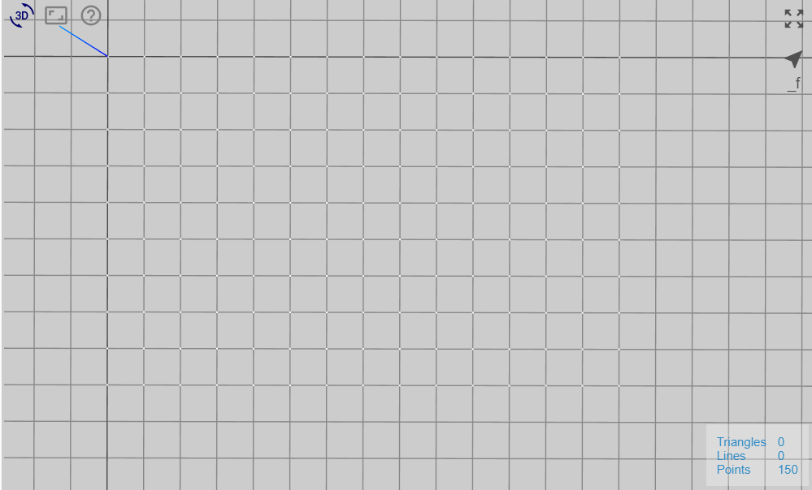
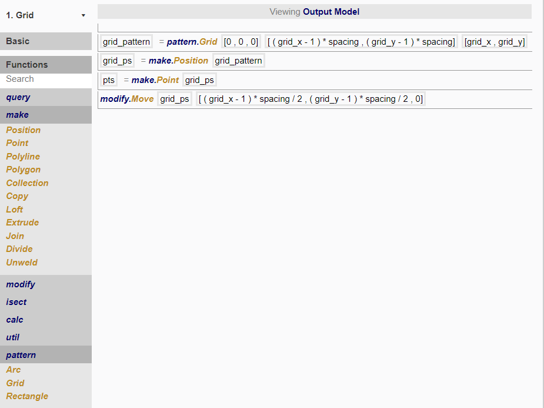

# Node 1

In this node, we want to make a grid with *grid_x* by *grid_y* positions, and have them at *spacing* distance apart. 

To do so, we created the following procedure:

Let us break down what is happening in each line. 

## pattern.Grid

Before creating positions, a list of coordinates are needed to specify where to create those positions. This function generates the coordinates in a grid pattern based on the input, which may then later be used to create positions.

When creating a grid of positions, there will always be one more position in each direction than the number of spaces—since spaces are between two points. 

**IMAGE**

number of spaces between positions in x-direction = `grid_x-1`
number of spaces between positions in y-direction = `grid_y-1`

To determine the dimension of the grid, 

x dimension = `(grid_x-1)*spacing`
y dimension = `(grid_y-1)*spacing`

## make.Positions and make.Point

From the coordinates returned by pattern.Grid, we are able to create positions in the model. 

Next, from the positions, we are able to create points. Points, polylines, polygons and other geometry are defined by positions and are dependent on them. Therefore, whenever you wish to create geometry, you need to first create positions. 

Here, points are created to help visualise where the positions are in the 3D viewer and to check if the outcome is as intended. This step is not strictly necessary. 

## modify.Move

We now want to move the grid of positions such that the corner of the grid starts at the world origin [0,0,0]. 

Since the grid has dimensions `(grid_x-1)*spacing` by `(grid_y-1)*spacing` with centre at the world origin, to shift it to the desired location, we will move it by half of its lengths:

`(grid_x-1)*spacing/2` in the x-direction; and
`(grid_y-1)*spacing/2` in the y-direction. 

The reason for the need to move the grid will be explained in the Node 3a. 