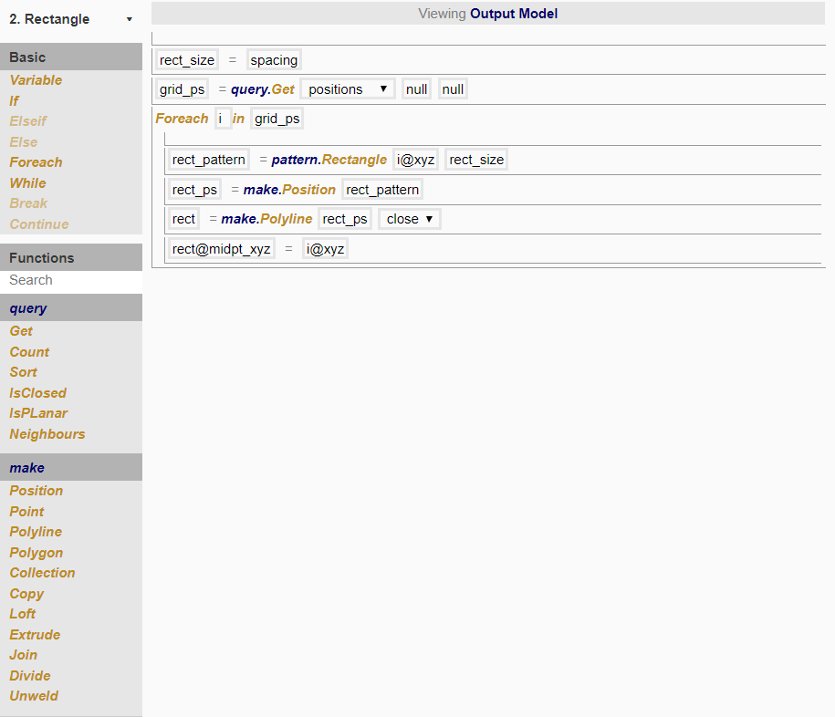

# Node 2

In this node, we want to make a closed rectangular polyline around each position created in the previous node. 

To do so, we created the following procedure:

## Defining of rectangle size as 'spacing'

If we want the rectangles created to be touching each other, each side of the rectangle will have length *spacing* by *spacing* (i.e. a square, since the grid was created with equal spacing). 

Using a value less than *spacing* creates a grid of rectangles with gaps in between; using a value more than *spacing* will create a grid of overlapping rectangles. 

## query.Get

By now, you would have noticed that all the geometry that was created in the previous node is automatically transferred to this one. In order to make use of the positions created in the previous node, we use the query function. This function is very powerful, as you can filter what is gotten by specifying attribute conditions. 

Here, the query.Get function returns a list of the positions created previously, without returning the points we created. 

## For-each loop

A for-each loop is a quick way of performing repeated actions without having to do them one by one. Since we are creating a rectangle for each position, putting the steps to create a rectangle from a position in this loop allows us to repeat all the steps in the loop for every single position. 

"For-each *i* in *grid_ps*" simply means for each item in the list of items. Since *grid_ps* is defined as all the positions previously created, this translates as "for each position in the list of positions previously created".

## pattern.Rectangle

This function works similarly to pattern.Grid in the previous node. Instead of returning a list of coordinates arranged in a grid, it returns a list of 4 coordinates in a rectangule. 

The centre of the rectangle is given by `i@xyz`. This translates to "'xyz' attribute of *i*", which defines the xyz-coordinates of *i*. (See Chapter 2.4 for further explanation)

## Setting the mid-point xyz as attribute on rectangle

We want to set the xyz-coordinates of the midpoint of the rectangle as an attribute on the rectangle, so that the coordinates can be easily used later on. 

`rect@midpt_xyz` creates the attribute called *midpt_xyz* for *rect*, and sets its value to be `i@xyz` (the xyz-coordinates of the position created in the previous node).