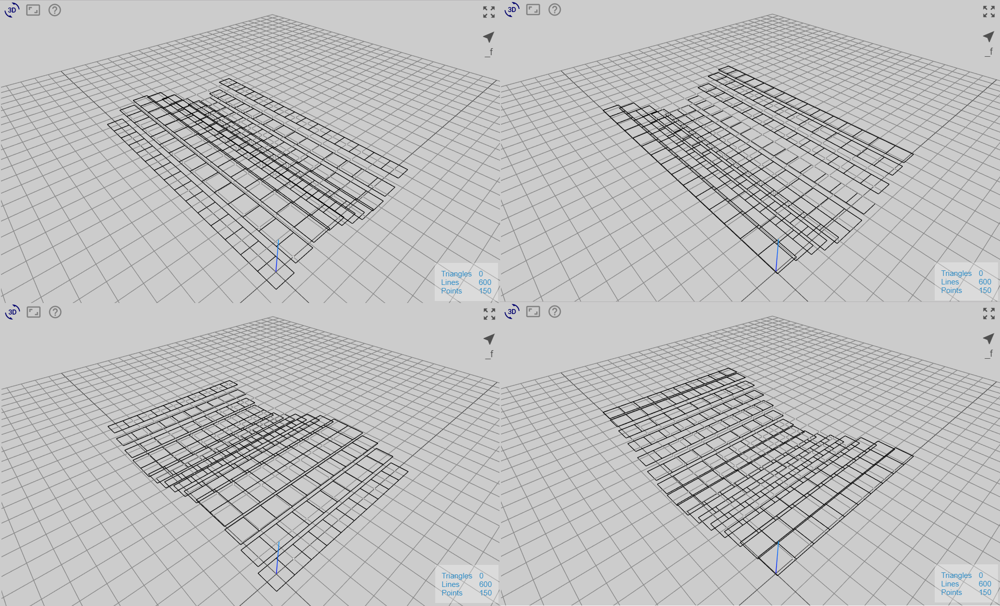
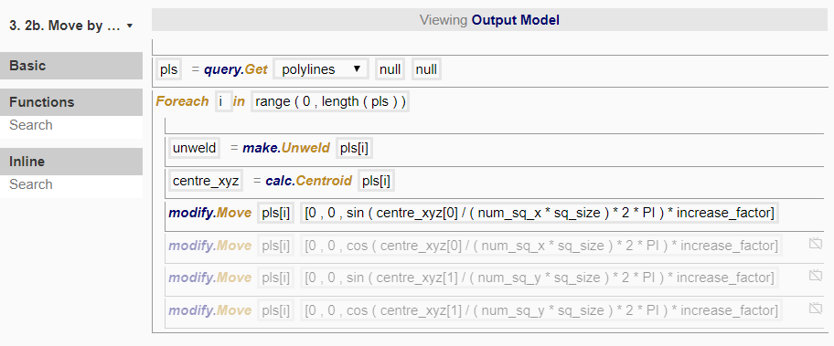

# Node 2b

In this node, we want to move each rectangle upwards depending on its position in the grid, in a way such that it the overall pattern resembles a sine or cosine wave. 

*Top: (1) sine wave based on x-coordinate (2) cosine wave based on x-coordinate*
*Bottom: (3) sine wave based on y-coordinate (4) cosine wave based on y-coordinate*

To do so, we created the following procedure:

The procedure, in terms of the functions used, is the same as Node 2a; the only difference is in the values inputted into the arguments. 

## Creation of sine/cosine waves

If we wish to displace the rectangles into a wave based on its position, we will again calculate the centre of each rectangle as in Example 2. Instead of using the x- and y- coordinates directly, we will take their values and perform some mathematics on it. 

__Parameterising:__

Current position in x-direction = `centre_xyz[0]`
Max position in x-direction = `num_sq_x * sq_size`

T-parameter (a ratio between current position and max position, expressed as a decimal between 0 and 1). 
t-parameter = `centre_xyz[0] / (num_sq_x * sq_size)`

As a result, the rectangle closest to the origin will have t-parameter value close to 0, and the rectangle farthest from the origin will have t-parameter value close to 1.

**IMAGE**

Now, we want to put the t-parameter in a sine or cosine function. Since we want to view the full range of the wave, we will take that t-parameter and multiply it by 2 π (which is expressed as 2 * PI), before putting it in the sin or cos function. 

**IMAGE**