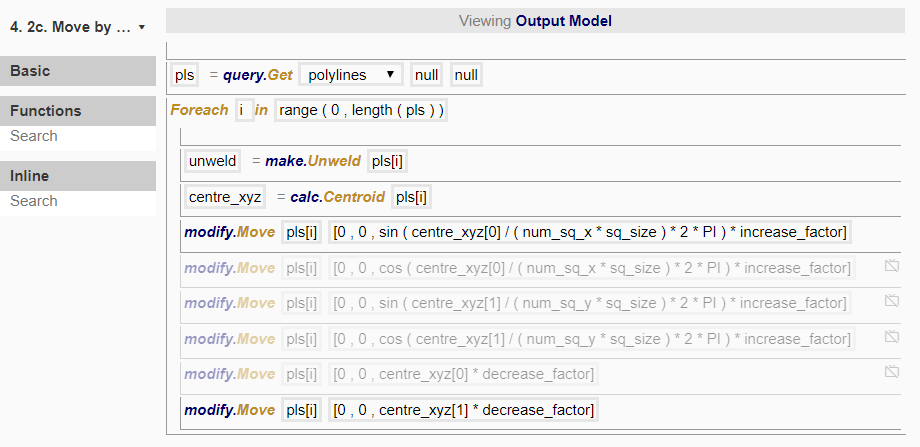
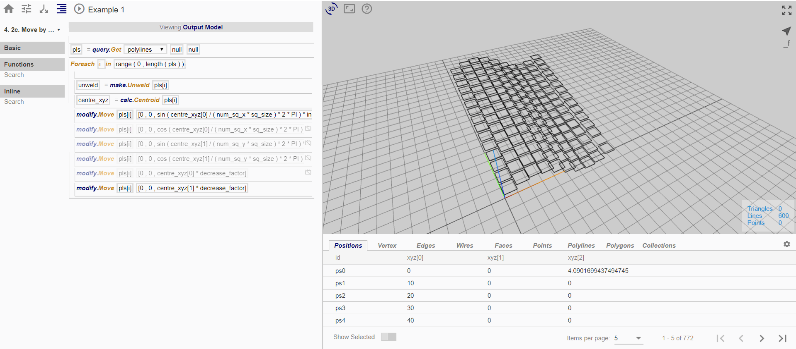

# Node 2c

In this node, we want to move each rectangle upwards depending on its position in the grid, in a way such that it the overall pattern resembles a combination of the results of nodes 3a and 3b. 

*Top: (1) sin(x)+y (2) cos(x)+y (3) sin(x)+x+y (4) cos(x)+x+y*
*Bottom: (5) sin(y)+x (6) cos(y)+x (7) sin(y)+x+y (8) cos(y)+x+y*

To do so, we created the following procedure:

Enabling and disabling different combinations of lines would produce different translations:

