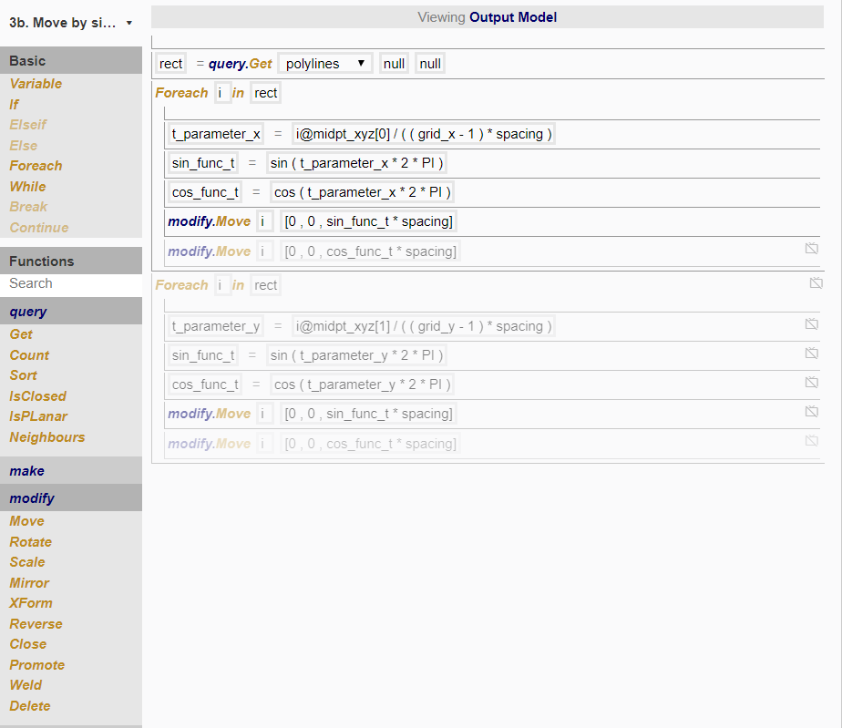

# Node 3b

In this node, we want to move each rectangle upwards depending on its position in the grid, in a way such that it the overall pattern resembles a sine or cosine wave. 

*Top: (1) sine wave based on x-coordinate (2) cosine wave based on x-coordinate*
*Bottom: (3) sine wave based on y-coordinate (4) cosine wave based on y-coordinate*

To do so, we created the following procedure:

