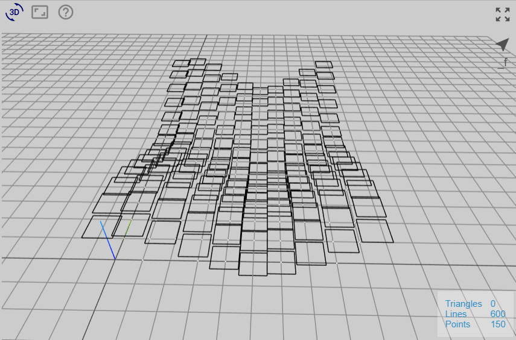
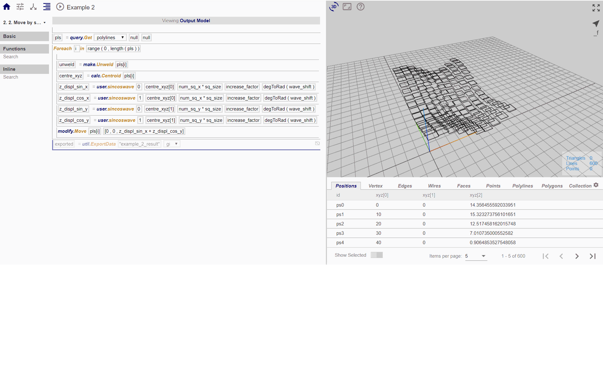

# Node 2

In this node, we want to use the function that we just created to displace the rectangles by translated sin or cos wave functions. 

*(1) sin-wave translated by 60 deg (2) cos-wave translated by 60 deg*

To do so, we created the following procedure:

In this node, we want to use the function previously created to displace the rectangles by a combination of translated sin or cos wave functions. 

*(1) sin + cos waves translated by 60 deg*

To do so, we created the following procedure:

Using different combinations of z_displ would produce different translations:

