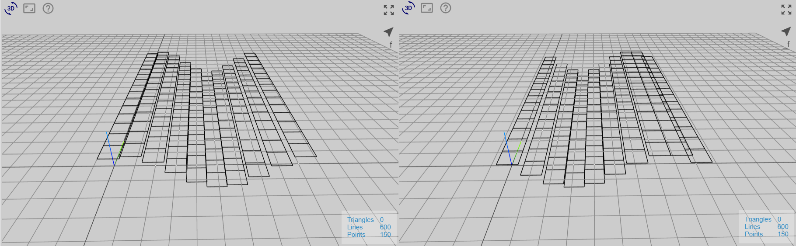
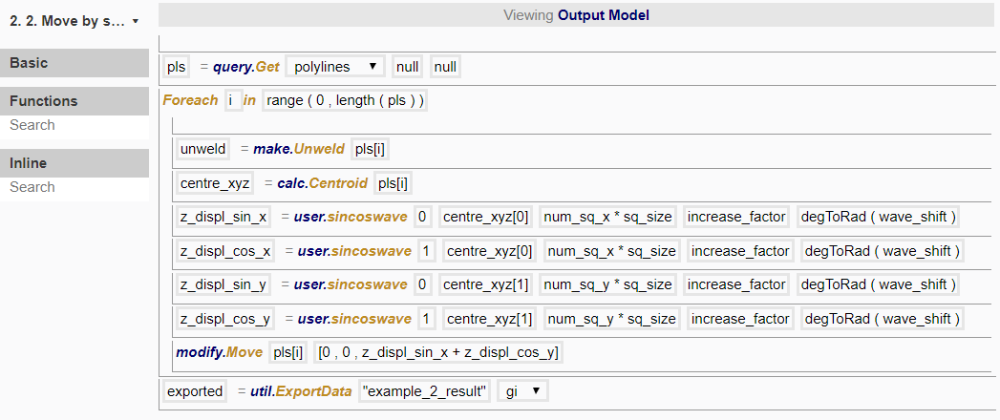

# Node 2

In this node, we want to use the function that we just created to displace the rectangles by translated sin or cos wave functions for x- or y- direction, or any combination of the above. 

*(1) sin-wave translated by 60 deg (2) cos-wave translated by 60 deg*

To do so, we created the following procedure:

## degToRad

We have used the inline function degToRad here to convert "wave_shift", which is in degrees, to radians, as the sincoswave function uses radians. Since all existing functions use radians, you can also use this inline function if you prefer to use degrees instead of radians directly. 

## Export

util.ExportData allows you to export the model geometry in the geo-info (gi) format or the obj format. The gi format is specific to Möbius and we will export the geometry to be used in Example 3. 

Once you export the geometry, you are able to use it directly by importing it without the need to run all the lines of code used to create it. This is helpful if you have already fixed certain parameters at desired values, and want the remaining transformations to be executed faster in the program (since it uses the geometry directly without computing it). However, the downside is that you are no longer able to use the previous sliders that you created to vary the output, since the geometry is fixed at the values at the point of exporting. 

## Variations

In Example 1 Node 2c, we mentioned that you are able to use different combinations by adding them in the argument itself. Here, instead of creating many modify.Move functions, using different combinations of z_displ would produce different translations:

