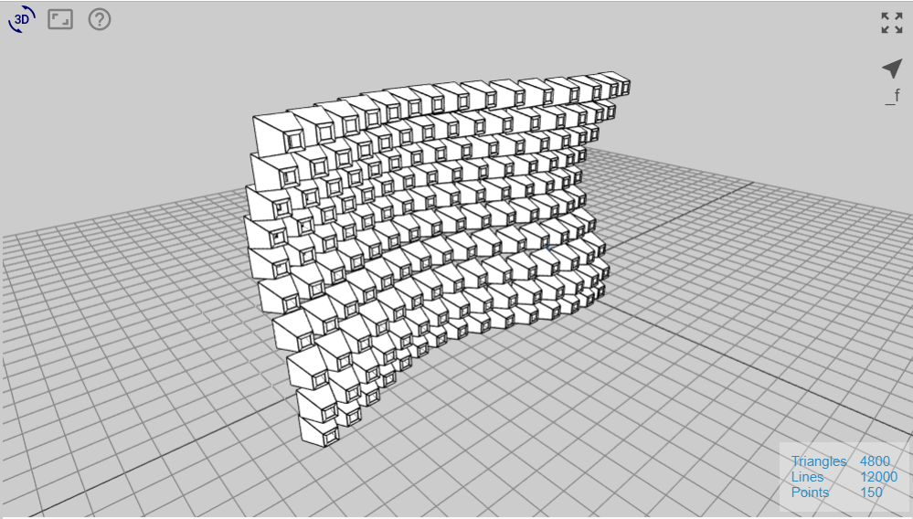
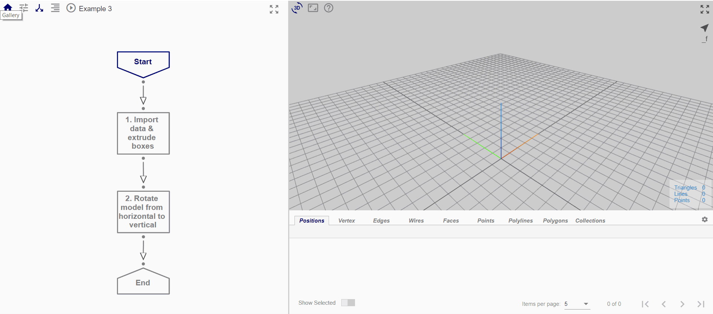

# Example 3

In Example 3, we are going to extrude boxes with scaled ends for each rectangular polyline in the imported geometry (exported from Example 2), then rotate the whole model. 

## Overview

The generation of the end result may be broken down into a series of smaller steps.

* *Start Node:* Input parameters
* *Creation of function from flowchart*: Flowchart to extrude boxes with ends scaled; can be imported as user-defined function
* *Node 1:* Import geometry from external file (Example 2)), then extrude boxes with ends scaled
* *Node 2:* Rotate the geometry from horizontal to vertical

## File

Click [here](https://mobius.design-automation.net/) to open the flowchart for Example 3 in Möbius Modeller.

Click [here](https://mobius.design-automation.net/) to download the file required to be imported. 