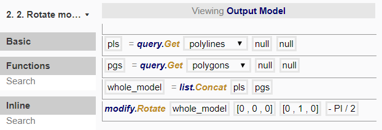

# Node 2

In this node, we want to rotate the model from lying on the horizontal plane to a vertical plane, such that it would resemble a wall with extrusions and apertures.

To do so, we created the following procedure:

