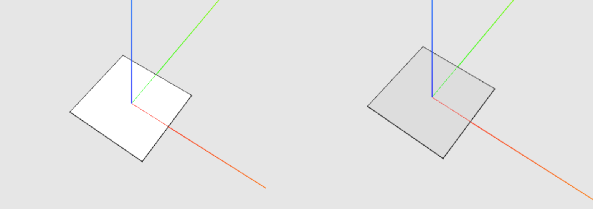

### Polygon {#polygon}

A polygon is an [object](Objects.md) defined by a [list](..\chapter_3_procedures\List.md) of at least three [positions](Position.md), comprising a closed wire and a face. The polygon is drawn sequentially based on the [order](..\chapter_3_procedures\List.md) of the [positions](Position.md) within the list.

| Description | Example |
|:-|-|
| Workflow of making a polygon |  |
| Representation of a polygon in the 3D Viewer |  | 
| Representation of a polygon in the Attribute Table |  |

 
#### Front and Back Surface

For each polygon, there is a front and back surface. A typical practice when modelling is to show the front surface on the exterior. By default, the front face is white while the back face is grey; however, users may customise the display colours of the surface in the [3D Viewer Settings](..\chapter_1_mobius_interface\3D_viewer_settings.md). 

> See [Changing the Display Colour of Front and Back Surfaces](..\chapter_1_mobius_interface\3D_viewer_settings.md) 
> See [Common Misconceptions and Workflow Mistakes: Order of Items in Lists](..\chapter_4_bugs_and_debugging\Order_of_Items_in_Lists.md)  
> See [Common Misconceptions and Workflow Mistakes: Direction of Normal](..\chapter_4_bugs_and_debugging\Direction_of_Normal.md)

 
#### Normal
A normal is a vector that is perpendicular to a polygon or pattern.

 
##### Calculating the Normal
Function calc.Normal is used in calculating normals of each polygon

###### Example: Extrude a Polygon in the Direction of its Normal

1.  Identify the polygon surface for extrusion.
2.  Use calc.Normal to calculate the normal. Set the length of extrusion in the `scale` argument box of the function.
3.  When extruding, key in the normal variable `distance` into the [argument box](/chapter_1_mobius_interface/procedure_line.md).

> See [Common Bugs and Misconceptions: Direction of Normal](..\chapter_4_bugs_and_debugging\Direction_of_Normal.md)