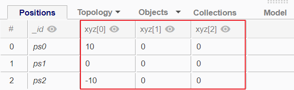
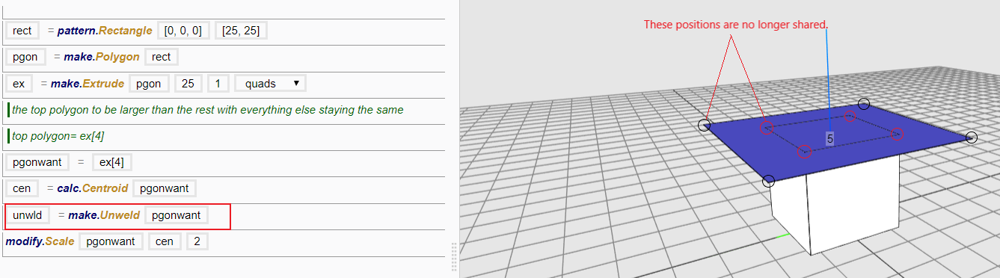
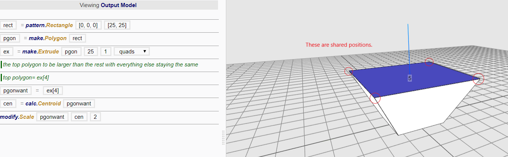

### Position {#position}

A position is an entity that is created at a coordinate in space.

While it is not an object, it is the primary unit by which all other geometries are defined. In order to make a [point](Point.md), [polyline](Polyline.md) or [polygon](Polygon.md), a position or a [list](..\chapter_3_procedures\List.md) of positions has to be created first, before being referenced subsequently.

| Description | Examples |
|:-|-|
| Function used to make positions |  |
| Representation of positions in the 3D Viewer |  | 
| Representation of a postion in the Attribute Table |  |

 
#### Coordinates

Every position in the [3D Viewer](..\chapter_1_mobius_interface\3D_view.md) in Mobius is described and defined by 3 coordinates along the X, Y and Z axis. The coordinates are numerically represented in a list of the 3 values in the sequence of [x, y, z]. When used in the correct context , i.e. in the input boxes of statements where coordinate values are accepted, Mobius will automatically recognised the list as coordinates.

[Coordinates attributes](Default_Attributes.md) are automatically generated in [Attribute Table](..\chapter_1_mobius_interface\3D_view.md) when entities are created in the 3D Viewer. However, as coordinates are not [entities](Entities.md), they will not be shown in the Attribute Table if entities are not created; and to visualise coordinates in the 3D Viewer, they have to be made into positions first.

#### Sharing Positions and Unwelding

When multiple objects share the same positions, modifying one object could mean modifying the common positions, which could affect all other objects that share those same positions.

When an object needs to be moved without affecting other [objects](Objects.md) sharing the same positions, it needs to be unwelded using make.Unweld function. Unwelding creates a duplicate of the shared positions (by creating new positions at that same location). As a result, the positions for the different objects will be different, even though they are at the same location.

