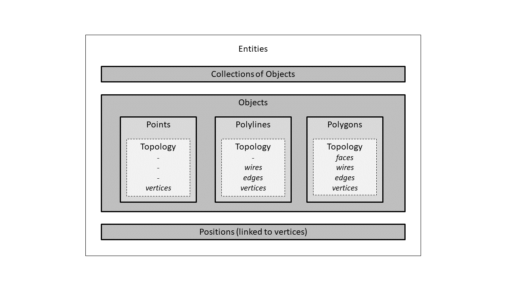

# Chapter 2: Geo-Info Data Model {#chapter-2-geo-info-data-model}

The Geo-Info (GI) data model is a 3D Geospatial Information model that stores [entities](Entities.md) and [attributes](Attributes.md) information. All the GI data can be found in the [3D View](../chapter_1_mobius_interface/3D_view.md) tab of the [Right Viewport](../chapter_1_mobius_interface/right_viewport.md).

The GI model allows for different types of entities to be defined using a data structure consisting of three main layers: [positions](Position.md), [objects](Objects.md), and [collections](Collection.md).

