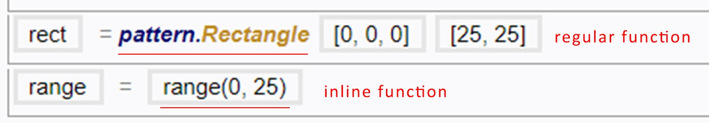

### Inline {#inline}

Below is a table of Inline feature categories that are available in Mobius. The description for each individual [function](/chapter_3_procedures/Functions.md) can be found in the [Tooltip](../chapter_1_mobius_interface/procedure_menu.md).

 

| Categories | Description |
| --- | --- |
| Globals | [Parameters](/chapter_1_mobius_interface/parameters.md) can be found here. |
| Expressions | Some of the common query and sort expressions are stored here. |
| Functions | Inline functions. |

 
#### Inline Functions

Unlike the regular functions in Mobius, Inline functions do not create [Procedure Lines](../chapter_1_mobius_interface/procedure_line.md) on their own when used. Instead, they are to be embedded within [variable input boxes](Inputs.md) as [expressions](/chapter_3_procedures/Expression.md).

 

| Category | Description |
| --- | --- |
| Constants | Constants such as the value of PI and plane properties. |
| Random | Random generator and picker. |
| Lists | An extensive list of list related operations. |
| Conversion | Performs conversion. |
| Vectors | Acquires and performs vectorial operations. |
| Colour | Colour picker. |
| Arithmetic | Standard mathematical operations. |
| Statistics | Performs statistical operations on lists. |
| Trigonometry | Mathematical operations related to trigonometry. |

 
##### Random

The Random functions help to randomly pick either a number, an integer or a list of items from a list of numbers. This function helps in producing an endless [iterations](/glossary/README.md) upon [execution](../chapter_1_mobius_interface/execute.md).

Examples: randomised colour scheme, randomised size, randomised extrusions

 
##### Lists

Below is a list of notable functions in this category. Do note that this list is not comprehensive. There are other functions available on the Mobius Modeller.

| Function | Description | Example |
| --- | --- | --- |
| Range(start, end, step?) | Returns a list of numbers from a specified range, with a constant increment between them. | Range(0, 10, 2) gives [0, 2, 4, 6, 8] |
| len(list) | Number of items in the list. | New_list = [0, 1, 2] len(New_list) = 3 |
| listCount(list, value) | Number of times the item appears in the list. | New_list = [0, 2, 2]  listCount(New_list, 2) = 2 |
| listJoin(list1, list2) | Joins two lists into a single list. | List1 = [0, 1, 2] List2 = [0, 2, 3] listJoin(List1, List2) = [[0, 1, 2], [0, 2, 3]] |
| listFlat(list, depth) | Creates a new list by flattening a list into a list of specified [depth](/chapter_3_procedures/List.md). | New_list = [[0, 2, 3], [0, 2, 4, 6]] listFlat((New_list),1) = [ 0, 2, 3, 0, 2, 4, 6] |

 
##### Conversion

Below is a list of notable functions in this category. Do note that this list is not comprehensive. There are other functions available on the Mobius Modeller.

| Function | Description | Example |
| --- | --- | --- |
| degToRad(deg) | Converts values in degree to Radian. (Do note that functions in Mobius only accepts angle values in Radian.) | degToRad (60) = PI / 3 (numerical value) |

 
##### Vectors

Below is a list of notable functions in this category. Do note that this list is not comprehensive. There are other functions available on the Mobius Modeller.

| Function | Description |
| --- | --- |
| VecAdd | Adds two vectors. |
| VecMult | Multiplies a vector by a number. |
| VecAng | Calculates the angle (0 to PI) between two vectors. |
| VecCross | Cross product of two vectors. |
| VecFromTo | Creates a vector between two points. |
| VecLength | Calculates the magnitude of a vector. |

 
#####Arithmetic

Below is a list of notable functions in this category. Do note that this list is not comprehensive. There are other functions available on the Mobius Modeller.

| Function | Description | Example |
| --- | --- | --- |
| power(numb, pow) | Returns the number to the specified power. | power(5, 2) = 25 |
| round(num) | Returns the number to its nearest integer. | round(25.4) = 25 |
| ceil(num) | Returns the number rounded up to its nearest integer. | ceil(28.4) = 29 |
| floor(num) | Returns the number rounded down to its nearest integer. | floor(28.7) = 28 |