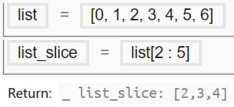
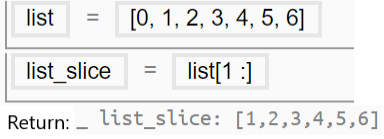
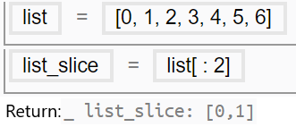
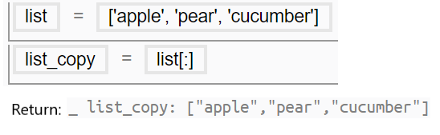
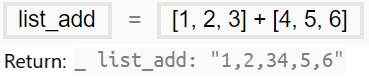

### List {#list}

A list can contain numbers, [variables](/chapter_3_procedures/Assignment_Statement.md) and [strings](Values.md).

Users with prior 3D modelling experience may see similarities between creating lists in Mobius and the Grouping function in direct modelling softwares. The strength of parametric modelling lies in the greater flexibility it offers when it comes to editing the list and manipulating the items in the list, such as joining lists, flattening lists in depth or making use of list indexing in conditional statements like [For](Loops.md), hence allowing more efficient modelling.

 
#### Indexing

An index refers to a position within an ordered list. Each item in a list is given an index from zero (at the beginning) to the length minus one (at the end). Square brackets are used to denote lists as well as the index of a list.

For instance, in list=[1,5,3], list[0] = 1 because 1 is the 1st item in the list; list[2]=3 as 3 is the last item in the list.

| List | Index |
| --- | --- |
| List = [[0,1,2], [3,4,5], [6,7,8]] | List[1] = [3,4,5] |
| a = entity1 b = entity2 List = [a, b] | List[0] = a = entity1 |

 
#### List Depth

The depth of a list is determined by the number of times by a sublist is nested inside of it.

A list with the depth of 1 is also known as a flat list, as it has no sublist nested in it.

| List | Depth of list |
| :--- | :--- |
| a = [0,1,2] | 1 |
| b = [1,2,3,[2,1]] | 2 |
| d = [1,2,3,[3,[2,1]],4] | 3 |

 
#### Order in a List

When using query.Get or any other functions with entity-sorting options, the list returned can be acquired in an ascending order, descending order or geometric order.

| Order | Description |
| --- | --- |
| Ascending | Data is in ascending order e.g “ps0”, “ps1”, “ps2” |
| Descending | Data is in descending order e.g “ps2”, “ps1”, “ps0” |
| Geometric | The sequence of obtaining the geometric data follows that of the entity e.g “ps1”, “ps2”, “ps3”. The sequence may or may not follow an ascending order, depending how the entity is constructed. |
 
When generating entities from a list of [positions](../chapter_2_geo-info_data_model/Position.md) using [functions](/chapter_3_procedures/Functions.md) like make.Loft and make.Polygon, the order of entities in the list is crucial in creating logical models. In fact, strange looking geometries may be generated when the list is not in geometric order. Therefore, when encountering such problems, users are advised to check through the order of entities.

 
> See [Common Bugs and Misconceptions: Order of Items in Lists](../chapter_4_bugs_and_debugging/Order_of_Items_in_Lists.md)

 

#### List Manipulations

<table>
    <col width ="20">
    <col width ="60">
    <col width ="150">
    <col width ="250">
    <tr>
    <th>Manipulation</th>
    <th>Code</th>
    <th>Note</th>
    <th>Example</th>
    </tr>
    <tr>
    <td rowspan="3">Slice</td>
    <td>sublist=[starting index: ending index]</td>
    <td>The sublist returned will begin with the item with starting index and stop right before the item with ending index. </td>
    <td></img>  Create a sublist from list[2] to list[4].</td>
    </tr>
    <tr>
    <td>sublist=starting index:]</td>
    <td>When the ending index is left blank, the Console will return a sublist that stops at the very last item of the parent list.</td>
    <td></img> Create a sublist from list[1] to the last item in list.</td>
    </tr>
    <tr>
    <td>sublist=[:ending index]</td>
    <td>When the starting index is left blank, the Console will return a sublist that begin with the very first item of the parent list.</td>
    <td>  Create a sublist from the first item in list to the list[1].
    </tr>
    <tr>
    <td>Copy</td>
    <td>sublist=[:]</td>
    <td>When both the starting index and the ending index are left blank, the Console will return the full parent list.</td>
    <td> Create a sublist with all items from the parent list.</td>
    </tr>
    <tr>
    <td>Mathematical Operation</td>
    <td>NA</td>
    <td>Lists are not numerals, they cannot be operated on mathematically.</td>
    <td> Strings are returned when 2 lists are added</td>
    </table>
    

