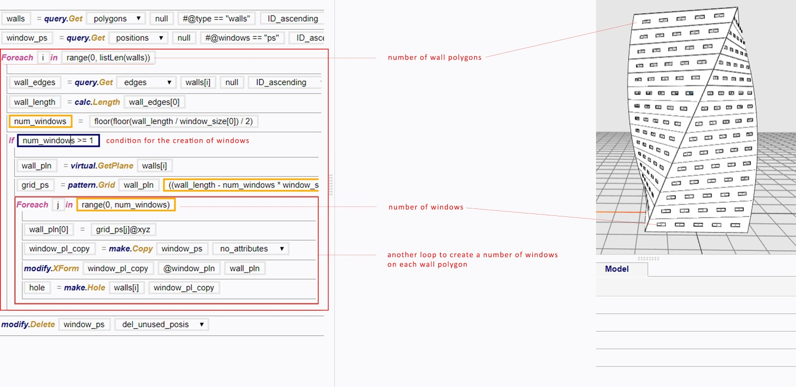

### For and While {#loops}

#### Overview

In computer programming, a loop is a statement that continually [iterates](../glossary/README.md) a sequence of codes until a certain condition is reached. There are two types of loops in Mobius, For and While. As [variables](Assignment_Statement.md) defined in a loop cannot be directly referenced outside of a loop, we will have to create lists to extract values out of the loops.

Loops are key procedures that bring out the importance of computational thinking in efficient 3D modelling. The efficiency is further improved in cases where multiple loops are nested within one another. 

While loops may seem rather challenging to apply at first, users are encouraged to constantly experiment with them, for the mastery in utilising the loops will prove to be extremely beneficial. After having a good grasp of the loops, users can create complex models using loops as shortcuts. This will quicken model making processes, especially when contrasted against [direct modelling](/introduction/README.md) methods.  

> See [Extract data out of a Loop Using Lists](/chapter_3_procedures/Extract_Data_Out_of_a_Loop_Using_Lists.md)

 
#### For

The For statement runs every [element](Assignment_Statement.md) in a finite [list](List.md) through the same sequence of codes. As such, it is also known as a For loop. In other words, it can be understood as for each. 

 
##### Application of For

The For function can operate on [elements](Assignment_Statement.md) in any [lists](List.md), be it a list of numbers or a list of entities.

 
###### Example 1. For item in a list of entities 
Each pgon in a list of pgons are cut with a copied and scaled down version of itself.   

 
###### Example 2. For item in a list of numbers
The list of number, range(0, 10) is used to generate 10 copies of pgon that are equally spaced out, as each of them is moved a distance ranging from 0 unit to 45 units from pgon.  

 
#### While
The While statement iterates a sequence of codes as long as the specified conditions remains true. It is also known as a While loop.

 
##### Application of While
As long as the total number is less than 100, the number of apples will increase by 4 each round. The process stops right before the total number of apples exceed 100.

 
#### Loops Within a Loop

Loop(s) can be created within a loop. There is no limit to the number of loops that can be used within one. 

 
###### Example

To understand a block of For loop like this, learners are encouraged to take time to use the [terminate](Terminate.md) function and print the returns from each statement to understand how the [Procedure Lines](../chapter_1_mobius_interface/procedure_line.md) work with one another in the [Procedure Space](../chapter_1_mobius_interface/procedure_space.md).

