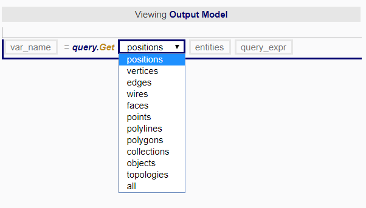

### Query

All query functions return a list of entities. The result will always be a list of entities, even if there is only one entity. In the case where the user only requires one entity, please remember to get the first item in the list. For example, query.get pgon = ["pg2"]. Hence, to acquire the polygon, please write it as such: pgon[0]. 

 

###### Query.Get

The query.Get function returns a list of [entities](../chapter_2_geo-info_data_model/Entities.md) from the model according to the conditions given by the user. It is used when [referencing](Rules.md) between nodes and across nodes.   

| Dropdown/ Input Box | Description |
| -- | -- |
|  | The first dropdown menu allows users to specify the type of entity that they are searching for. |
|  | The `entities` argument box is for defining the boundary of search, or what the users are searching amongst. The users may specify variable(s) or `null` if they intend to search the entire model without restricting the search to any boundary. |

 
###### Query.Filter

The function filters entities using the following parameters:  
* entities: list of entities to filter
* name: the attribute name to use for filtering
* index: attribute index to use for filtering, or null
* operator_enum: enum, the operator to use for filtering e.g ==, !=, >=, <=, >, <, =
* value: the attribute value to use for filtering

 

###### Query.Sort

The function sorts entities based on a sort expression.  
The sort expression should use the following format: `name`, where 'name' is the attribute name. Entities can be sorted using multiple expressions as follows: 'name1' && 'name2'.  

 

###### Query.Invert

The function returns a list of entities excluding the specified entities, using the following parameters:  
* ent_type_enum: a dropdown which allows the type of entities returned to be selected
* entities: a list of entities to be excluded

 

###### Query.Perimeter

The function returns a list of perimeter entities. In order to qualify as a perimeter entity, entities must be part of the set of input entities and must have naked edges. The function uses the following parameters:  
* ent_type: enum, select the type of entities to return
* entities: list of entities

 

###### Query.Neighbor

The function returns a list of neighboring entities. In order to qualify as a neighbor, entities must not be part of the set of input entities, but must be welded to one or more entities in the input. The function uses the following parameters:
* ent_type_enum: enum, select the types of neighbors to return
* entities: list of entities

 

###### Query.Type

Checks the type of an entity.  

For is_used_posi, returns true if the entity is a posi, and it is used by at least one vertex. For is_unused_posi, it returns the opposite of is_used_posi. For is_object, returns true if the entity is a point, a polyline, or a polygon. For is_topology, returns true if the entity is a vertex, an edge, a wire, or a face. For is_point_topology, is_polyline_topology, and is_polygon_topology, returns true if the entity is a topological entity, and it is part of an object of the specified type.

For is_open, returns true if the entity is a wire or polyline and is open. For is_closed, it returns the opposite of is_open. For is_hole, returns ture if the entity is a wire, and it defines a hole in a face. For has_holes, returns true if the entity is a face or polygon, and it has holes. For has_no_holes, it returns the opposite of has_holes.

The function uses the following parameter:  
* entities: an entity, or a list of entities
* type_query_enum: enum, select the conditions to test agains

 
###### Examples

 
#### Inline Query Expression

Inline Query Expression is in the form of `entity#entity_type?@attributename=="value"`.

The above expression translates as such:

| Character | Description |
| -- | -- |
| entity | Any entities |
| entity_type | Type of entities in short form e.g ps (position), _v (vertices), _e (edges), _w (wire), _f (face), pt (point), pl (polyline), pg (polygon), co (collection)|
| attribute name | The attribute name e.g type, surface |
| value | The attribute value in strings e.g "windows" |

 
###### Examples

* `pgon#ps?@balc=="rails"` : Returns positions that are attributed `balc` and are given the attribute value `"rails"` from the entity `pgon`.
* `#pg?@col_centroid` : Returns polygons that are attributed `col_centroid` from the entire model. 