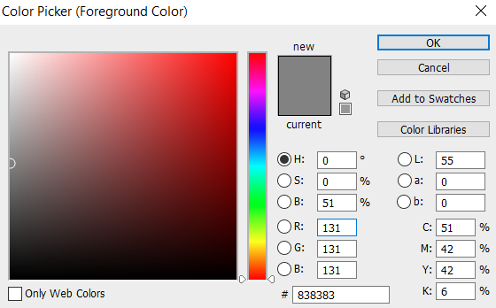

### Render {#render}

Rendering is the process of generating a more realistic looking 3D model. In Mobius, this can be achieved using the colour attribute, Render functions and/or the 3D Viewer Setting.

> See [3D Viewer Setting](../chapter_1_mobius_interface/3D_viewer_settings.md)

 
#### Colour Attribute

Users can assign different colours to [entities](../chapter_2_geo-info_data_model/Entities.md) using [reserved attribute](../chapter_2_geo-info_data_model/Reserved_Attributes.md) `vertices@rgb`. 

1.  Obtain the list of vertices of the entity using function [query.Get](QueryGet.md).
2.  Create attribute name rgb for the vertices, assigning an attribute value that is a list of 3 numbers, that are equivalent to the desired colour code values divided by 255. The colour code is a [list](List.md) of 3 numbers that represents red, green and blue in the RGB colour wheel respectively. 

 
###### Example

The desired colour has the following code: 131, 131, 131 on a RGB colour picker. Divide each number by 255 and input it in Mobius in the form of a list [0.7, 0.7, 0.7].  

 
#### Render Functions

Users will have to create [reserved attribute](../chapter_2_geo-info_data_model/Reserved_Attributes.md) `polygons@material` first before using the Render functions.
 
##### Glass
Users can make adjustments to the material’s opacity value.

##### Basic Material
Similar to Glass. However, it provides the option to change colour.
