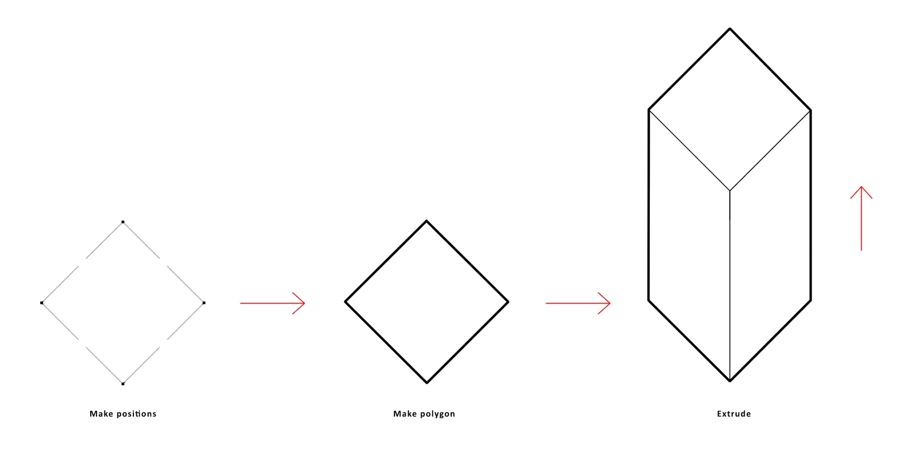

## Creating a Simple, Single Volume {#creating-a-simple-single-volume}

1.  Create a base with [positions](../chapter_2_geo-info_data_model/Position.md). This can be achieved by creating individual positions manually or with [functions](../chapter_3_procedures/Functions.md) such as pattern.Rectangle.
2.  make.Polygon using the above positions.
3.  Extrude the [polygon](../chapter_2_geo-info_data_model/Polygon.md) and a simple volume is formed.

