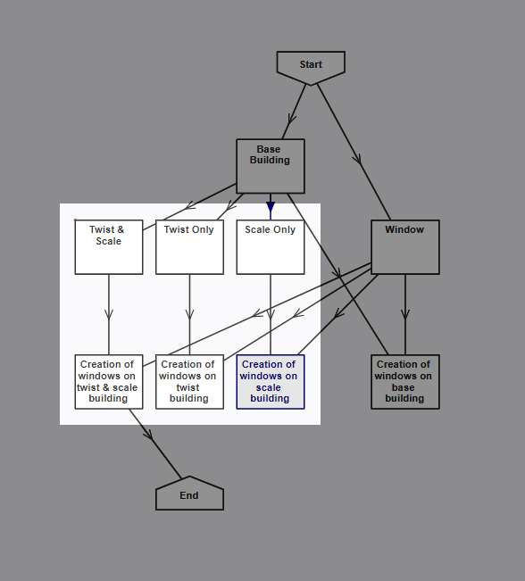

## Creating a Complex Volume with Nodes in Parallel {#creating-a-volume-with-nodes-in-parallel}

Connecting [nodes](../chapter_1_mobius_interface/nodes.md) in [parallel](../chapter_1_mobius_interface/transfer_of_info_btw_nodes.md) is useful for those who wish to see each transformation step separately. The [entity](../chapter_2_geo-info_data_model/Entities.md) from each parallel node can be merged together to form the final output. However, it is important to note that codes do not share across parallel nodes. In other words, the user cannot query.get information from a node that is parallel to the current node.

The flow chart above shows 3 sets of parallel nodes. They are independent of each other and will give 3 different results when connected to the end node.

Parallel nodes are useful when it comes to deleting useless or repeated entities. This will clean up the model and increase the process speed of mobius. This is especially useful when working on complex models.
